**Team**: [Aman Mathur](https://amanmathur.com/), [Annie Xu](https://www.anniehxu.com/), [Mudmie Chuthamsatid](https://www.mudmie.com/), and [Vevina Trinh](https://vevevev.ca/)
**Summary**: Evolving the visual experience for Canada's Biggest Hackathon, now bigger, brighter and friendlier than ever!

  

## What is Hack the North?
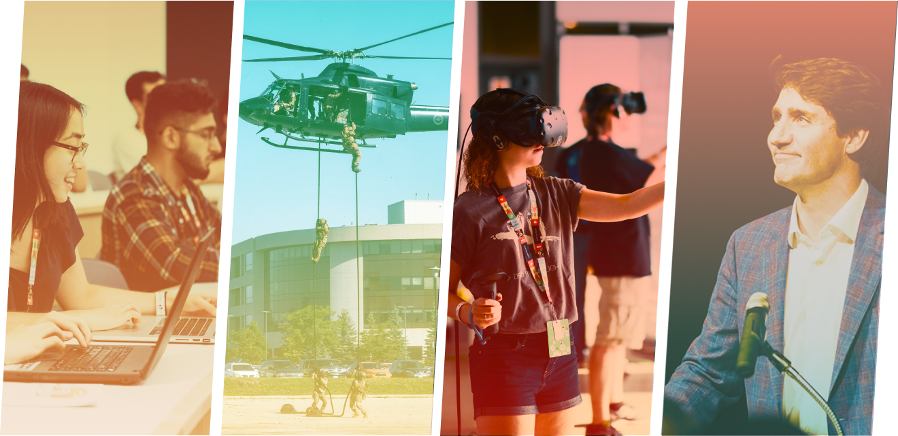
_Photo credit: Hack the North photographers_

 

> Hack the North is Canada’s biggest hackathon, where 1,500 students of different skill levels come together from 20+ countries to experiment and create unique software or hardware projects from scratch. We empower and enable teams to make something great in only 36 hours by providing an abundance of resources like workshops, mentors, sponsors, and hardware components.

_- [hackthenorth.com](https://hackthenorth.com)_

 

Throughout the first 5 years of Hack the North, we've hosting 7,000+ attendees serving as a career-defining event for our student hackers, a valuable recruiting pipeline for our sponsors, and a way to give back and inspire and be inspired by the community to our speakers, judges, and volunteers.

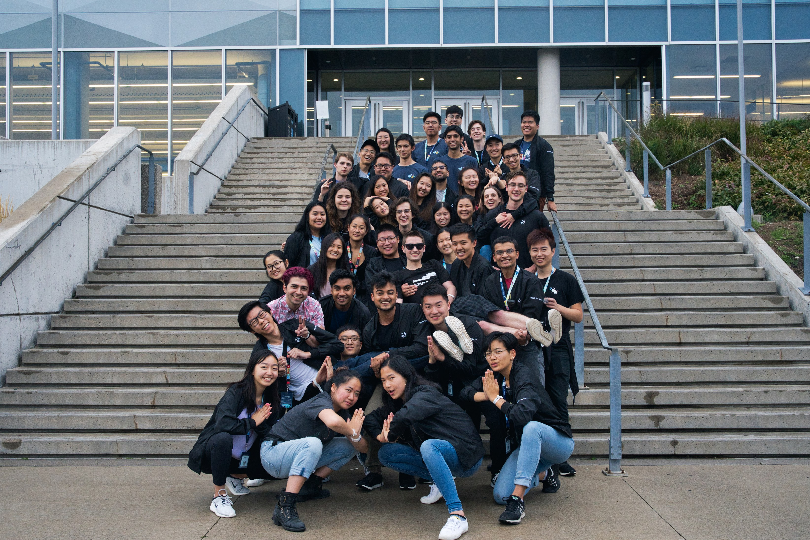
_The Hack the North 2019 ~~team~~ family_

 

## Role

In January 2019, I became the **design lead** for Hack the North, solely in charge of leading and mentoring a team of 4 junior and senior product and graphic designers. I had the pleasure of working with an amazing team consisting of [Aman Mathur](https://amanmathur.com/) and [Mudmie Chuthamsatid](https://www.mudmie.com/) who were Product Designers and [Annie Xu](https://www.anniehxu.com/) and [Vevina Trinh](https://vevevev.ca/) who were Graphic Designers on the team. As a team, we were responsible for defining the visual experience for this large-scale international event.

I lead the team with a focus on **collaboration, ownership, and design-centered thinking**. I encouraged this by having weekly sync up meetings where we kept each other updated and encouraged collaboration and knowledge exchange, having a #design-feedback channel on Slack where designers and everyone on the team can provide feedback on designs, having bi-weekly 1:1s for design team members, and leading hand-offs and workshops (such as a Frontend development workshop) when necessary.

For the sixth annual Hack the North, we wanted to grow beyond Canada's biggest hackathon to become the **world's biggest student-run hackathon**. This meant scaling the event by 50%, bringing in 500 more hackers (for a total of 1,500 hackers!)

 

This presented an important challenge for the design team:

> **How do we evolve and scale our brand while staying core to our mission?**

 

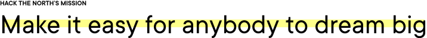

 
 

## Making a brand

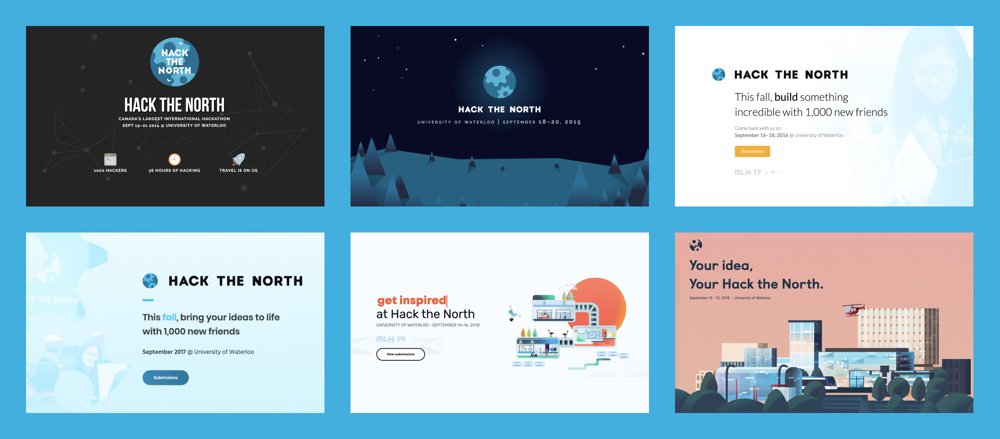
_Hack the North branding from 2014 - 2019_

 

Since Hack the North's inception, the hacker experience has always been the top priority. **Here, we sweat the small stuff, especially when it comes to design**.

When it came time to develop the 2019 brand, we wanted to keep up the momentum and legacy of our previous branding, while being able to create a flexible and scalable design system, making it easy to iterate and re-use across different applications and mediums.

Staying true to our roots, we wanted our brand personality to still reflect the following (courtesy of the 2018 marketing and design team):
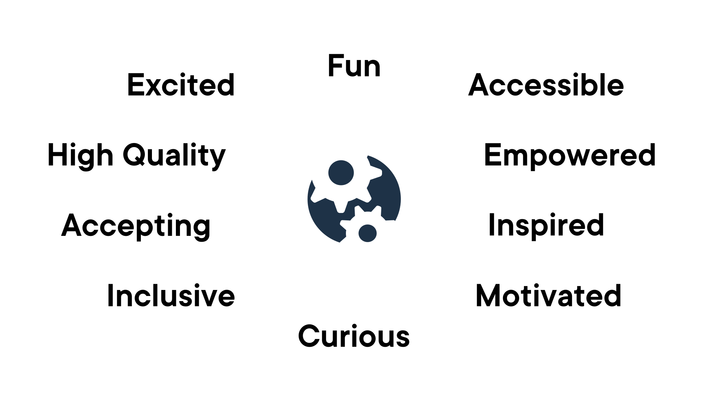
_Hack the North Brand Personality_

 

For 2019, our amazing marketing team also developed a new slogan **#YourHackTheNorth**, all about promoting creativity and ownership 

Together as a team, we put together a mood board of fonts, colours, and illustration styles that embodied these attributes and voted (using stickers of our faces) for those we liked best.

 

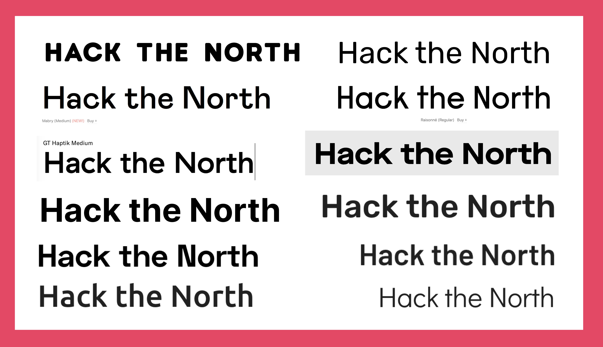
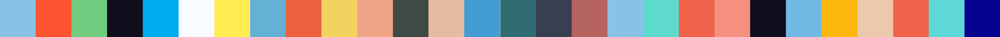

_Some of the fonts, colours and illustration styles the team liked_

 

After we made some sample designs for our website and did some competitive analysis, we arrived at our final decision.

 
 

### Logo and Typeface
We decided to keep our icon representing two interlocking gears, a simple, instantly recognizable symbol for Hack the North, originally created by our founders.

 

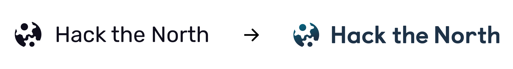
_Logo evolution from 2018 to 2019_

 

Our new title typeface **[Castledown](https://www.colophon-foundry.org/typefaces/castledown/)** was selected because of it's friendly, playful, and welcoming features, **promoting the inclusive nature of Hack the North** and a contrast to other big and intimidating hackathon and technology company logos. Castledown was also extremely readable, in fact, it was originally to **[help children read and write](https://www.wired.com/2014/05/to-help-students-learn-this-school-created-its-own-font/)**.

The **[Inter typeface family](https://rsms.me/inter/)** was also selected as an ultra-clean typeface designed for all-screens with impressive support for many [OpenType features](https://rsms.me/inter/#features).

 

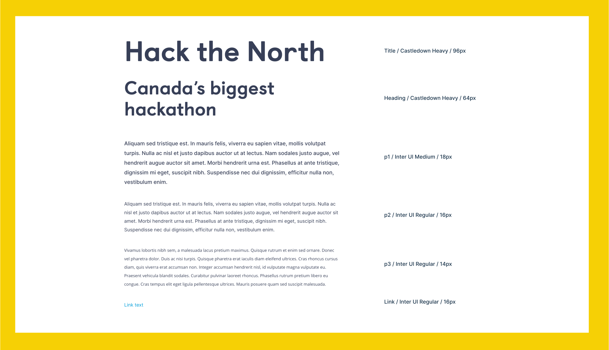

 
 

### Colours
Traditionally, Hack the North has had an all-blue colour scheme that has dominated the tech industry. This year, we continued the momentum started by the 2018 design team but took it further. We **de-emphasized the blue in our brand and added in as many colours as we could** create a **brighter, bolder, friendlier, and more inclusive brand**.

 

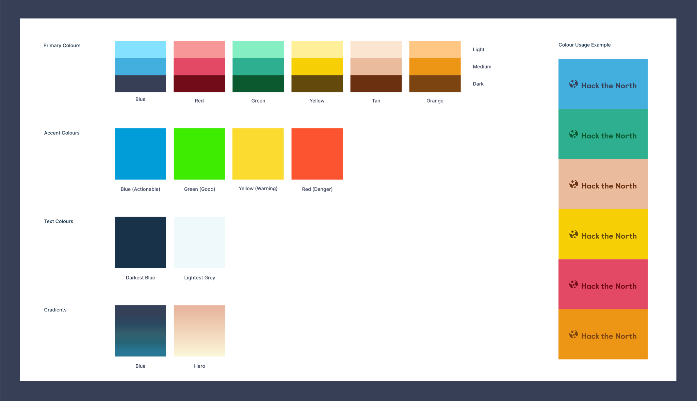

    <iframe width="560" height="315" src="https://www.youtube-nocookie.com/embed/s_FhBuN769I?controls=0" frameborder="0" allow="accelerometer; autoplay; encrypted-media; gyroscope; picture-in-picture" allowfullscreen></iframe>

_View the Hack the North 2019 promo video with the new branding (Created by: Grip Films)_

 

#### Addressing Accessibility
We also ensured that our colour scheme met the **[WCAG (Web content Accessibility Guidelines) 2.0 AA standards](https://www.w3.org/TR/WCAG20/)** and also increased font sizes and checked that our designs were colour blind friendly.

 
 

### Illustrations
[Vevina Trinh](https://vevevev.ca/) and [Annie Xu](https://www.anniehxu.com/), our amazing graphic designers helped breathe new life to our illustrations. Using a flat but textured gradient style with bold geometric shapes and the colours we decided on they created fun and playful illustrations. We **used campus landmarks and gears as our main branding elements to help maintain recognition** and created a new mascot Robogoose to serve as a friendly and playful face to our users.

 

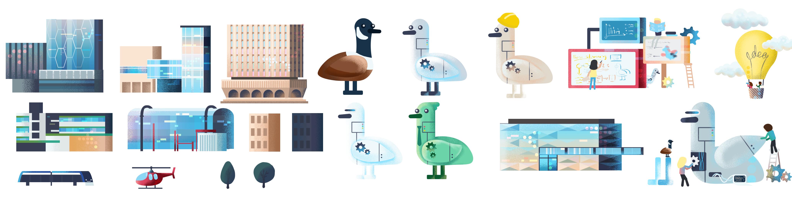
_Sample of some of the illustrations created for our 2019 branding (Credit: [Annie Xu](https://www.anniehxu.com/) and [Vevina Trinh](https://vevevev.ca/))_

 
 

## Website
One of the main design tasks I worked on was designing a brand new website for 2019 utilizing the new branding we created. I was the product designer for this project while [Annie Xu](https://www.anniehxu.com/) was the Graphic Designer and created all the illustrations.

 

### Process
We started off as a team by creating explorations and analyzing what we liked and didn't like from the explorations and the current website. After this brainstorming process, I knew that I wanted to make the website **more interactive, use more colours, and showcase more pictures of our event and event attendees** (our 2018 website didn't feature many pictures of our hackers or of the event). This would help to solve a few problems:
1. Interactivity helped make the website more interesting and playful and created delightful experiences for our users
2. Adding in more colours and diverse pictures of event attendees made our event appear less intimidating and accessible to all
3. Having pictures of our event helped legitimize the event and instills trust and imagination by allowing users to picture what the event will be like

 

_Iteration process of the website_

👉 You can view the website live on [hackthenorth.com](hackthenorth.com)

 
 

### Hero
<video autoplay loop muted width="100%">
  <source src="/post1/hero.mp4" type="video/mp4" />
</video>

_Hero animation and parallax effect_

 

Using illustrations created by [Annie Xu](https://www.anniehxu.com/), I added simple animations using Adobe [After Effects](https://www.adobe.com/products/aftereffects.html) and [Lottie](https://airbnb.io/lottie/). We decided to feature our campus, highlighting elements like the new [ION light rail transit](https://www.grt.ca/en/ion-light-rail.aspx), and the [helicopter that lands during the event](https://globalnews.ca/news/5893653/canadian-special-forces-chopper-waterloo-flight/). Our illustrations are created in our illustration style and used to **create a cinematic experience for our users, showcase the venue, and invoke some recognition** for when they come to the event.

We also used a **parallax effect to uncover the different layers of the illustration** enticing a user to "enter" by scrolling through and learning more about the event.

 

_The website was built with responsivity in mind_

  

### Use of Colour
<video autoplay loop muted width="100%">
  <source src="/post1/colour-changing.mp4" type="video/mp4" />
</video>

_Background colour changing throughout the day_

 

The hero also **changes colour throughout the day based on the user's time**, creating a **unique experience for our users each time they visit the site**.

 

<video autoplay loop muted width="100%">
  <source src="/post1/scrolling.mp4" type="video/mp4" />
</video>

_Background colour changing while scrolling through the site_

 

Gradient transitions were also used to **smoothly transition users from one section to another while immersing the user in the experience**.

 
 

### New ways of displaying information
<video autoplay loop muted width="100%">
  <source src="/post1/attendee-showcase.mp4" type="video/mp4" />
</video>

_Interactive attendee showcase_

 

<video autoplay loop muted width="100%">
  <source src="/post1/gear-slideshow.mp4" type="video/mp4" />
</video>

_Gear slideshow, featuring images from the event_

 

This year, I also experimented with new ways to present useful information. One new addition was a gear slideshow, **highlighting the inspiring mentors, fun activities, new people, and state-of-the-art hardware available at the event**. I also added a carousel featuring first-hand accounts and pictures of event attendees to **inspire and motivate those visiting** the site to apply and highlighting the **unique experiences and diversity** of our attendees.

 We also had access to **HotJar and Google Analytics** which allowed us to analyze which parts of the website were performing well and could make modifications necessary. An example of this is the attendee showcase section. Originally, this section did not auto-scroll between user stories. When we noticed the heatmap didn't show a lot of user's interacting with the section, we added the auto-scroll functionality which **boosted engagement to that section**.

 
  

### Organizer Carousel
<video autoplay loop muted width="100%">
  <source src="/post1/organizer.mp4" type="video/mp4" />
</video>

_Organizer feature on the website_

 

One of the ways Hack the North is often perceived is that it is an elite event for a certain group of people put on by the University of Waterloo. This is far from it! We are actually an **entirely voluntary student-created event organized by just under 40 students in our spare time**.

By adding a carousel with our faces, we humanize the people behind the event, while celebrating the dedication of our organizers and also playfully highlighting our interests using the 'Made with ❤ in ____' tagline that is popular in tech culture.

  

### Handoff Process
Having experience as a frontend developer, I tried to make the developer handoff process as smooth as possible frontend team (Michal Jez, Jevin, Alex Xie, and Jason Hong). **I created a design system in Figma**, componentizing common UI components (which allowed them to create a frontend UI library), included detailed handoff notes for each section along with a history of changes and scheduled a video call where we walked through the different parts of a design.

 

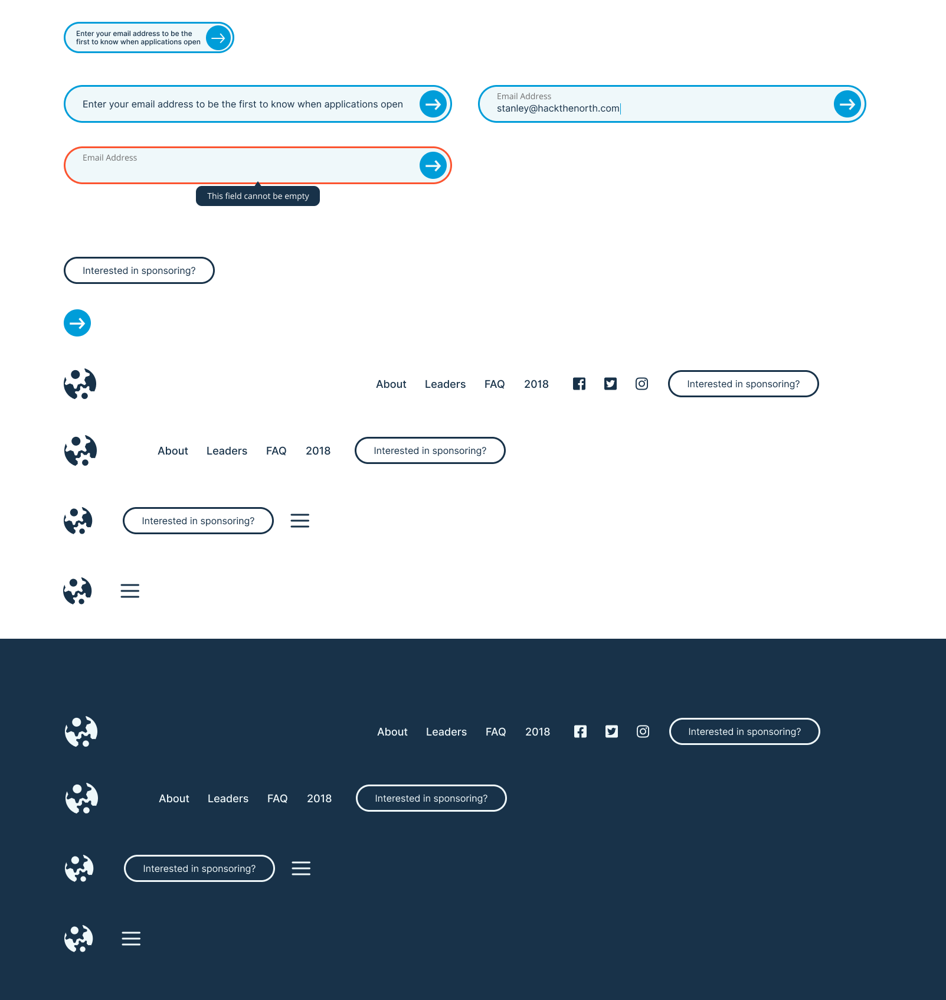
_An example of some of the components built-in Figma_

  

## Other Projects
### Building a QR Scanning Application
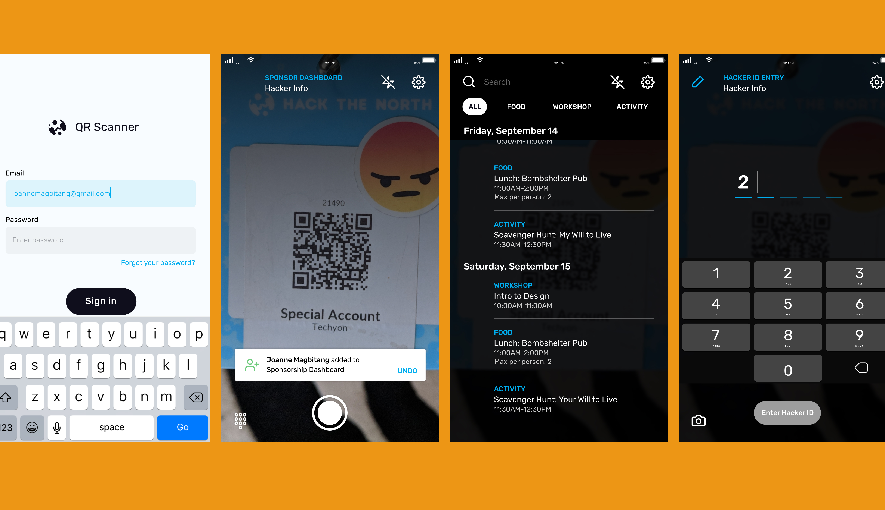
 

In 2018, I was a frontend developer on the team. With designs from [Joanne Magbitang](http://joannemagbitang.com), I developed a **QR Scanning Application using React Native for iOS and Android** used to scan the badges of 1,500+ event attendees.

  

### Building the Hack the North 2018 websites
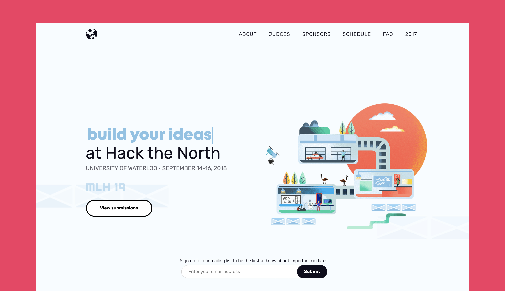

 

I also helped develop the [2018 Hack the North website](2018.hackthenorth.com). One aspect that I led was the implementation of [GatsbyJS](https://www.gatsbyjs.org/) to support **Progressive Web App features like offline support**. I also added a content management system that allowed any organizer on the team to update and publish content in real-time. This helped significantly **streamline many team processes**. For example, sponsors are confirmed throughout the year by our equally amazing sponsorship team. With the content management system, sponsorship members were able to add the logo to our website and set the correct sizing without having to ask a developer.

  

### Day-of-App
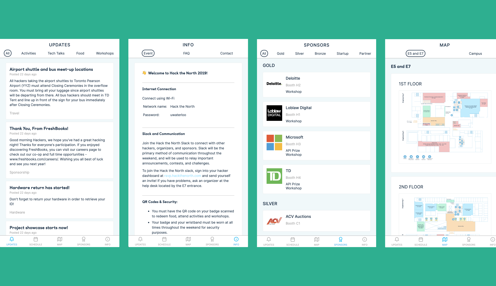
 

With the help of [Aman Mathur](https://amanmathur.com/), Kevin Pei, Michal Jez, and Daniel Williams, we developed the **[live.hackthenorth.com](live.hackthenorth.com) progressive web app, a day-of app experience for our event attendees with responsive capabilities, offline, and notification support**.

  

### Digital Signage
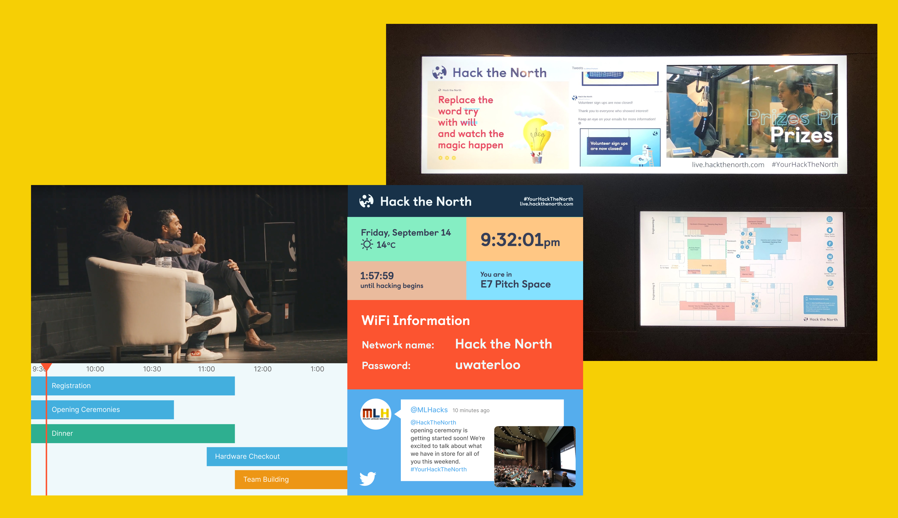

To find ways to **improve the discoverability of activities during the event** and to better communicate with our hackers we introduced a new digital signage system, which includes displaying our schedule, social media, empowerment messages, and our video on screens throughout the venue.

  

### Organizer Applications
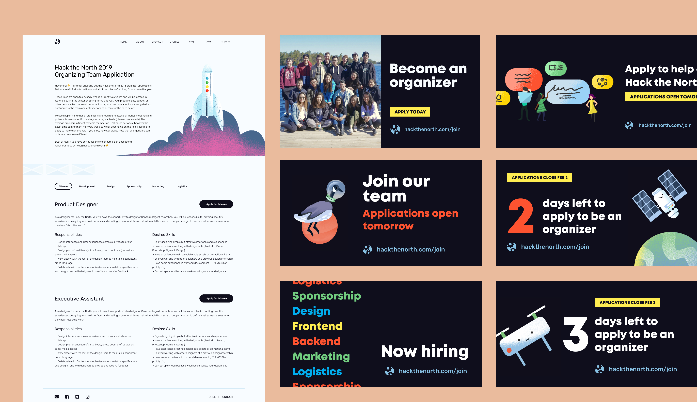

Using illustrations created by [Gracie Xia](https://graciexia.myportfolio.com), I designed **social media assets and an online job portal for organizer applications**.

  

### April Fools
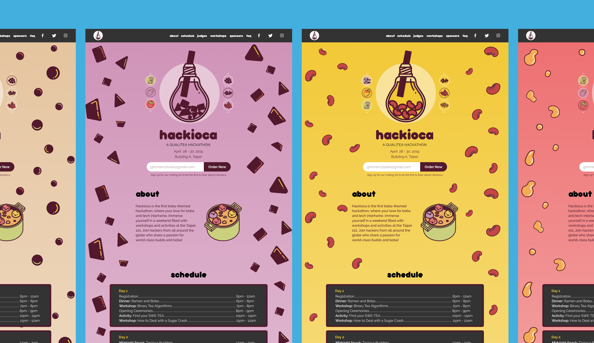

Every year, Hack the North puts together an April Fool's joke. In 2018, I helped develop [lollahacks.com](lollahacks.com). In 2019, [Mudmie Chuthamsatid](https://www.mudmie.com/), [Vevina Trinh](https://vevevev.ca/) and Annie designed [hackioca.com](hackioca.com). One unique aspect of the 2019 website was the **interactive create your own boba section in the hero** which I helped prototyped in Figma.

  

<!-- ## Other 2019 design team initiatives

### Social Media
Credit: [Vevina Trinh](https://vevevev.ca/)

### Badges
Credit: [Vevina Trinh](https://vevevev.ca/)

### Swag
Credit: [Annie Xu](https://www.anniehxu.com/) and [Vevina Trinh](https://vevevev.ca/)

### Sponsorship Package
Credit: [Vevina Trinh](https://vevevev.ca/)

### Signage
Credit: [Annie Xu](https://www.anniehxu.com/) and [Vevina Trinh](https://vevevev.ca/)

### Empowerment Posters
Credit: [Vevina Trinh](https://vevevev.ca/) and [Annie Xu](https://www.anniehxu.com/)

### Sponsorship Dashboard
Credit: [Aman Mathur](https://amanmathur.com/)

### Hacker Applications
Credit: [Aman Mathur](https://amanmathur.com/), [Mudmie Chuthamsatid](https://www.mudmie.com/), and [Annie Xu](https://www.anniehxu.com/) -->

## Takeaways
Being on the Hack the North team was an incredibly rewarding experience. I was able to watch my team members grow, define the visual experience of the world's biggest hackathon, and design and develop applications used by thousands of people.

  

### Key results
- Cultivated a design-driven culture while leading a team of 4 senior and junior product and graphic designers
- Evolved branding, now brighter, friendlier and more inclusive than ever
- Designed a new website by creating a component-based design system
- 43% increase in visitors to [hackthenorth.com](hackthenorth.com) before applications opened when compared to 2018
- Designed and developed applications and websites to handle 8,000+ applications, 2,300+ event attendees, handling 5,000,000+ requests, and 10,000+ unique monthly active users

 

---

 

Wow, that was a lot! Thanks for making it this far. If you want to learn more about me check out my other projects, my [resume](/resume.pdf) or [shoot me an email](stanleystanhuang@gmail.com).

Interested in joining the Hack the North family? **Shoot me an email at [stanley@hackthenorth.com](mailto:stanley@hackthenorth.com)**.

